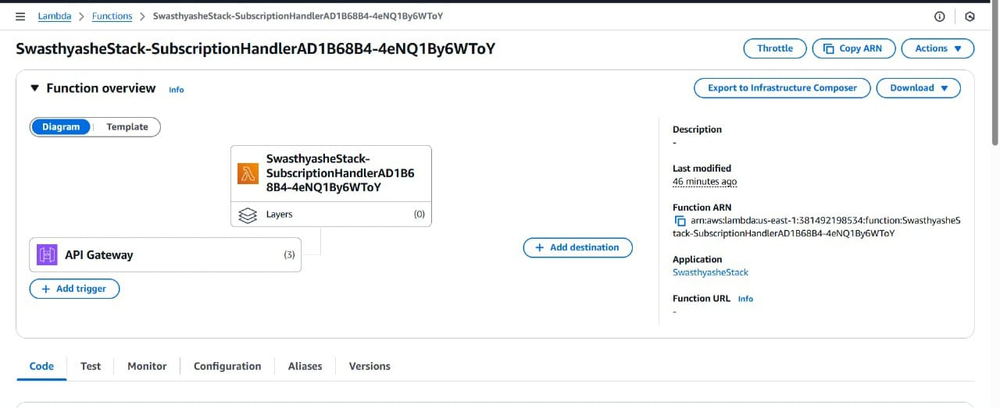

# Swasthyashe 🌿✨  
**A Holistic Women's Health & Wellness Platform**  

Swasthyashe blends **ancient Ayurvedic wisdom** with **modern science** to empower women in their health journey. From **menstrual health** to **pregnancy care**, **mental wellness**, and **skin & hair care**, this app provides **natural remedies**, **self-care tips**, and **scientific insights** for holistic well-being.  

## 🚀 Features  
✔ **Period Health:** Natural remedies for menstrual cramps, cycle tracking, and hormone balance.  
✔ **Mental Wellness:** Stress management, emotional well-being, and self-care practices.  
✔ **Sexual & Reproductive Health:** Knowledge on reproductive rights, cervical cancer, and STDs/STIs.  
✔ **Skin & Hair Care:** Ayurvedic solutions for different skin types and common hair problems.  
✔ **Pregnancy Care:** Traditional & modern tips for a healthy pregnancy journey.  

## 🛠️ Tech Stack  
- **Frontend:** React.js, Tailwind CSS  
- **Backend:** AWS Lambda, Amazon DynamoDB, API Gateway  
- **Cloud Infrastructure:** AWS CDK, AWS IAM, CloudWatch  

## 🔥 AWS Services Used  
✅ **AWS Lambda:** For serverless backend functions handling user requests.  
✅ **Amazon DynamoDB:** Storing health recommendations, user interactions, and subscriptions.  
✅ **Amazon API Gateway:** Connecting the frontend with backend services securely.  
✅ **AWS IAM:** Managing secure access controls.  
✅ **Amazon CloudWatch:** Monitoring and logging application performance.  




## 📂 Project Setup  
### 1️⃣ Clone the Repository  
```bash
git clone https://github.com/DeepikaSidda/Swasthyashe.git
cd Swasthyashe
```
### 2️⃣ Backend Setup  
```bash
cd backend
npm install
npm install -g aws-cdk
cdk bootstrap
cdk deploy
```
### 3️⃣ Frontend Setup  
```bash
cd ../frontend
npm install
npm start
```
The frontend will be available at **http://localhost:3000**  

## 📌 Contribution  
Want to contribute? Open an issue or submit a pull request!  
